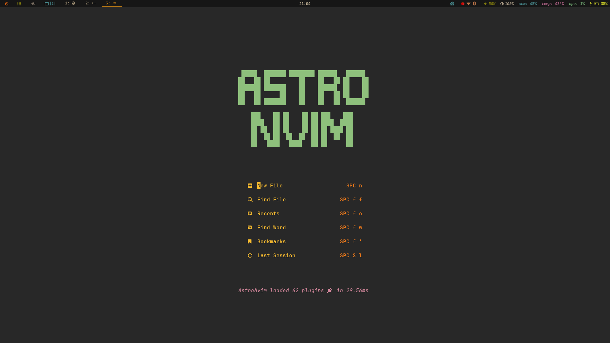
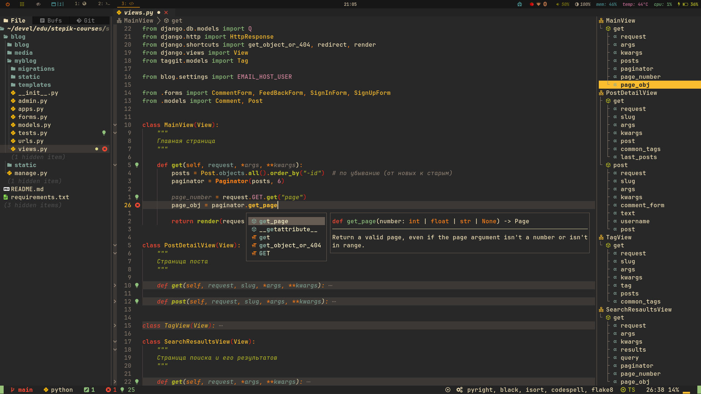

<h1 align="center">
    AstroNvim User Configuration
</h1>

## :star2: Preview




## :zap: Requirements

- [Nerd Fonts](https://www.nerdfonts.com/font-downloads) (_Optional with manual intervention:_See [Documentation on customizing icons](https://astronvim.com/Recipes/icons))
- [Neovim 0.8+ (_Not_ including nightly)](https://github.com/neovim/neovim/releases/tag/stable)
- [Tree-sitter CLI](https://github.com/tree-sitter/tree-sitter/blob/master/cli/README.md)
(_Note:_ This is only necessary if you want to use `auto_install` feature with Treesitter)
- A clipboard tool is necessary for the integration with the system clipboard
(see [`:help clipboard-tool`](https://neovim.io/doc/user/provider.html#clipboard-tool) for supported solutions)
- Terminal with true color support (for the default theme, otherwise it is dependent on the theme you are using)
- Optional Requirements:
  - [ripgrep](https://github.com/BurntSushi/ripgrep) - live grep telescope search (`<leader>fw`)
  - [lazygit](https://github.com/jesseduffield/lazygit) - git ui toggle terminal (`<leader>tl` or `<leader>gg`)
  - [go DiskUsage()](https://github.com/dundee/gdu) - disk usage toggle terminal (`<leader>tu`)
  - [bottom](https://github.com/ClementTsang/bottom) - process viewer toggle terminal (`<leader>tt`)
  - [Python](https://www.python.org/) - python repl toggle terminal (`<leader>tp`)
  - [Node](https://nodejs.org/en/) - node repl toggle terminal (`<leader>tn`)

## :hammer: Installation

#### Make a backup of your current nvim and shared folder

```bash
mv ~/.config/nvim ~/.config/nvim.bak
mv ~/.local/share/nvim ~/.local/share/nvim.bak
rm -rf ~/.cache/nvim
```

#### Install Core AstroNvim

```bash
git clone https://github.com/AstroNvim/AstroNvim ~/.config/nvim
```

#### Install User Config

```bash
git clone https://github.com/leonzag/AstroNvim_user.git ~/.config/nvim/lua/user
```

#### Initialize AstroNvim

```bash
nvim --headless "+Lazy! update" +qa
cd ~/.config/nvim/lua/user; nvim
```
